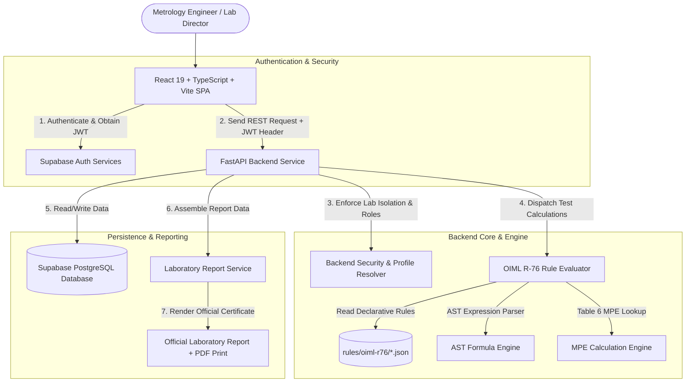

# METRA — Metrology Evaluation & Test Report Automation

[-blue.svg)](https://www.oiml.org/)
[](https://fastapi.tiangolo.com/)
[](https://react.dev/)
[](https://www.typescriptlang.org/)
[](https://supabase.com/)

**METRA** is a full-stack, enterprise-grade laboratory information and metrology automation system designed for testing laboratories, Legal Metrology authorities, type-evaluation bodies, and instrument manufacturers.

It automates the evaluation workflow for **Non-Automatic Weighing Instruments (NAWIs)** in strict accordance with the **OIML R 76-1:2006 (E)** international recommendation.

---

## 1. Overview

Testing weighing instruments for legal metrology and type approval requires precise measurement recording, complex changeover error calculations ($P = I + 0.5e - \Delta L$), dynamic Maximum Permissible Error (MPE) calculations across multiple accuracy classes (Class I, II, III, IIII), and strict rule traceability.

METRA eliminates manual calculation errors and standardized document bottlenecks by providing:
- **Deterministic Rule Engine**: Executes OIML calculation formulas using a safe Abstract Syntax Tree (AST) parser.
- **Multi-Tenant Laboratory Management**: Complete data isolation per testing laboratory with role-based access control.
- **Specialized Test Execution Workbench**: Context-aware observation entry forms for weighing, repeatability, eccentricity, tare, zero-setting, temperature, voltage variation, and EMC procedures.
- **Official Laboratory Type-Evaluation Reports**: Generates formal certificate reports bearing the testing laboratory's official header, accreditation numbers, OIML conformity determination, and dual sign-off blocks (**Evaluated By** & **Approved & Verified By**).

> **Disclaimer**: METRA is an evaluation automation tool intended for accredited testing laboratories and metrology institutions. Software evaluation reports represent the testing laboratory that executed the evaluation.

---

## 2. System Architecture

METRA uses a decoupled architecture with a React 19 single-page application, a FastAPI backend service, a declarative JSON rule engine, and Supabase PostgreSQL with service-role security.



---

## 3. Key Features

### 🔐 Authentication & Multi-Tenancy
- **Tenant Isolation**: Every instrument, evaluation, observation, and report is strictly scoped to the authenticated user's `laboratory_id`.
- **Role-Based Access Control (RBAC)**:
  - **Owner**: Full laboratory access, team management, setting updates, and official report approval.
  - **Admin**: Laboratory management, evaluation management, and report verification/approval.
  - **Engineer**: Instrument registration, test observation entry, and evaluation execution.

### ⚖️ Instrument Management
- Registration of NAWIs with metrological parameters:
  - Maximum Capacity ($Max$) & Minimum Capacity ($Min$)
  - Verification Scale Interval ($e$) & Actual Scale Interval ($d$)
  - Accuracy Classes: **Class I**, **Class II**, **Class III**, **Class IIII**
  - Units ($\text{kg}, \text{g}, \text{mg}, \text{t}$) and operational features (Tare, Electronic, Power Source)

### 📋 6-Step Evaluation Workbench
1. **Instrument Selection**: Link an evaluation to a registered laboratory instrument.
2. **Environmental Conditions**: Record ambient temperature (°C), relative humidity (%), atmospheric pressure (hPa), and test location.
3. **Applicability Determination**: Automated assessment of test relevance based on instrument construction and specs.
4. **Test Execution**: Interactive observation forms with changing changeover calculations and automatic error tracing.
5. **Rule Engine Calculation & Traceability**: Real-time evaluation against OIML MPE limits with full clause traceability.
6. **Overall Compliance Finalization**: Aggregate decision computation (**PASS**, **FAIL**, **REQUIRES REVIEW**).

### 🧪 Supported OIML R-76 Test Procedures
- **Weighing Performance Test (§A.4.4.1 / §A.4.4.3)**: Multi-step load testing with changeover error calculation ($E = P - L$, $E_c = E - E_0$) and Table 6 MPE limits.
- **Repeatability Test (§A.4.10 / §3.6.1)**: Multi-reading range analysis ($|P_{\max} - P_{\min}| \le |\text{MPE}|$).
- **Eccentricity Test (§A.4.7 / §3.6.2)**: 5-position off-center loading evaluation (Center, Front, Rear, Left, Right).
- **Tare Operation Test (§A.4.6.1)**: Subtractive and additive tare accuracy testing.
- **Zero-Setting & Accuracy Tests (§A.4.2.1 & §A.4.2.3)**: Zero-setting range percentage verification and zero accuracy limit ($\pm 0.25e$).
- **Temperature & Environmental Tests (§A.5.3.1 / §A.5.3.2)**: Span error at extreme temperatures.
- **Voltage Variation Test (§A.5.4)**: Operation under power supply fluctuation limits.
- **EMC & Disturbance Tests (Annex B & Annex C)**: Immunity procedures for electronic weighing instruments.

### 📄 Official Laboratory Evaluation Reports
- **Primary Laboratory Branding**: Header prominently features the testing laboratory's official company name, accreditation number, and address from the database.
- **Dynamic User Sign-Off**:
  - **Evaluated By**: Automatically populated with the Engineer's full name and role.
  - **Approved & Verified By**: Resolved from authorized Owner/Admin profiles. Displays **Pending Approval** if unassigned.
- **Conformity Determination Statement**: Formal legal metrology statement of conformity to OIML R 76-1:2006 (E).
- **Print & PDF Support**: Custom `@media print` styling optimized for browser printing and vector PDF export.

---

## 4. Repository Structure

```
metra/
├── backend/                  # FastAPI Python Service
│   ├── app/
│   │   ├── engine/           # OIML R-76 Rule Engine Core
│   │   │   ├── applicability.py   # Test applicability logic
│   │   │   ├── calculator.py      # Rule calculation dispatcher
│   │   │   ├── evaluator.py       # High-level evaluation pipeline
│   │   │   ├── formula_parser.py  # AST mathematical formula evaluator
│   │   │   ├── models.py          # Pydantic engine data models
│   │   │   ├── mpe_engine.py      # Dynamic Table 6 MPE calculation
│   │   │   ├── result_builder.py  # Evaluation output assembler
│   │   │   ├── rule_loader.py     # JSON rule file loader & indexer
│   │   │   └── validator.py       # Observation & context input validator
│   │   ├── models/            # Database Pydantic schemas
│   │   ├── routers/           # REST Endpoint Routers
│   │   │   ├── dashboard.py       # Metrics & dashboard stats
│   │   │   ├── evaluations.py     # Evaluation & test execution API
│   │   │   ├── instruments.py     # Instrument registration API
│   │   │   ├── reports.py         # Certificate & report API
│   │   │   ├── settings.py        # Laboratory tenant profile API
│   │   │   └── team.py            # Laboratory member management API
│   │   ├── services/          # Business Logic Layer
│   │   │   ├── evaluation_service.py # Evaluation CRUD & calculation runner
│   │   │   └── report_service.py     # Report data model & sign-off assembler
│   │   ├── config.py          # Environment settings loader
│   │   └── deps.py            # Supabase auth & tenant isolation dependencies
│   ├── tests/                 # Pytest engine test suite
│   ├── main.py                # FastAPI application entry point
│   ├── requirements.txt       # Python dependencies
│   └── .env.example           # Backend environment template
│
├── frontend/                 # React 19 + TypeScript Frontend
│   ├── src/
│   │   ├── components/
│   │   │   ├── common/        # PageHeader, StatusBadge, Stepper, ErrorBoundary
│   │   │   ├── evaluation/    # Status badges & results components
│   │   │   ├── evaluations/   # Specialized Test Observation Forms
│   │   │   │   └── forms/     # Weighing, Repeatability, Eccentricity, etc.
│   │   │   ├── instruments/   # Instrument forms & badges
│   │   │   ├── layout/        # AppLayout, Sidebar, MobileNav
│   │   │   └── ui/            # Radix/Shadcn primitives (Button, Card, Input, etc.)
│   │   ├── hooks/             # Custom React hooks (useAuth)
│   │   ├── lib/               # Utility functions (cn, clsx, tailwind-merge)
│   │   ├── pages/
│   │   │   ├── admin/         # Admin Dashboard
│   │   │   ├── auth/          # Login & Registration pages
│   │   │   ├── engineer/      # Engineer Dashboard
│   │   │   ├── evaluations/   # Evaluation Setup, Test Selection, Execution, Results
│   │   │   ├── instruments/   # Instrument Management pages
│   │   │   ├── owner/         # Owner Dashboard
│   │   │   ├── reports/       # Report List & Official Report Preview/Print
│   │   │   ├── settings/      # Laboratory Settings page
│   │   │   └── team/          # Team & Member Management page
│   │   ├── services/
│   │   │   ├── api/           # Typed REST API clients (evaluations, reports, etc.)
│   │   │   └── supabase/      # Supabase Client & Auth client
│   │   ├── types/             # TypeScript type definitions (evaluation, instrument, auth)
│   │   ├── App.tsx            # Main application router
│   │   └── main.tsx           # Application entry point
│   ├── package.json           # Node.js dependencies
│   └── vite.config.ts         # Vite build configuration
│
├── rules/
│   └── oiml-r76/             # Declarative OIML R-76 Rule Specifications
│       ├── accuracy_classes.json   # Class I - IIII definitions & limits
│       ├── applicability_rules.json# Test suitability rules
│       ├── calculation_rules.json  # Changeover error & performance formulas
│       ├── definitions.json        # Terminology & clause metadata
│       ├── metadata.json           # OIML edition & version metadata
│       ├── mpe_rules.json          # Table 6 MPE step limits & equations
│       ├── tests.json              # Complete OIML R-76 test procedures
│       └── validation_rules.json   # Input tolerance & domain checks
│
├── README.md                 # Project Documentation
└── .gitignore                # Git exclusion specifications
```

---

## 5. Prerequisites & Local Setup

### Prerequisites
- **Node.js**: v18.0 or higher
- **Python**: v3.10 or higher
- **Supabase**: Active Supabase project with PostgreSQL database

---

### Step 1: Clone the Repository
```bash
git clone https://github.com/your-org/metra.git
cd metra
```

---

### Step 2: Configure Environment Variables

#### Backend (`backend/.env`)
Copy `backend/.env.example` to `backend/.env`:
```env
SUPABASE_URL=https://your-project-ref.supabase.co
SUPABASE_SERVICE_KEY=your-supabase-service-role-key
ALLOWED_ORIGINS=http://localhost:5173,http://localhost:3000
```

#### Frontend (`frontend/.env`)
Create `frontend/.env`:
```env
VITE_SUPABASE_URL=https://your-project-ref.supabase.co
VITE_SUPABASE_PUBLISHABLE_KEY=your-supabase-anon-key
VITE_API_BASE_URL=http://localhost:8000
```

---

### Step 3: Backend Setup & Execution
```bash
# Navigate to backend directory
cd backend

# Create Python virtual environment
python -m venv venv

# Activate virtual environment
# Windows (PowerShell):
.\venv\Scripts\Activate.ps1
# Linux/macOS:
source venv/bin/activate

# Install dependencies
pip install -r requirements.txt

# Start FastAPI development server
uvicorn main:app --reload --port 8000
```

The FastAPI backend will be available at `http://localhost:8000`. Interactive API documentation (Swagger UI) will be accessible at `http://localhost:8000/docs`.

---

### Step 4: Frontend Setup & Execution
```bash
# Open a new terminal and navigate to frontend directory
cd frontend

# Install Node modules
npm install

# Start Vite development server
npm run dev
```

The React frontend will be available at `http://localhost:5173`.

---

## 6. OIML R-76 Rule Engine Specifications

The calculation engine is entirely driven by declarative JSON rules stored in `rules/oiml-r76/`. This separation ensures that metrological rules remain traceable to official publication clauses without being buried in application code.

### Formulas & Error Calculations
- **Indication Prior to Rounding ($P$)**:
  $$P = I + 0.5e - \Delta L$$
- **Uncorrected Error ($E$)**:
  $$E = P - L$$
- **Corrected Error ($E_c$)**:
  $$E_c = E - E_0$$
- **Repeatability Range ($R$)**:
  $$R = |P_{\max} - P_{\min}| \le |\text{MPE}|$$

### Table 6 Maximum Permissible Error (MPE) Step Limits
For Class III instruments during initial verification:
- $0 \le m \le 500e \implies \text{MPE} = \pm 0.5e$
- $500e < m \le 2000e \implies \text{MPE} = \pm 1.0e$
- $2000e < m \le 10000e \implies \text{MPE} = \pm 1.5e$

---

## 7. Verification & Build Commands

### Frontend Linting & Build
```bash
cd frontend

# Run ESLint
npm run lint

# Build production bundle
npm run build
```

### Backend Test Suite
```bash
cd backend

# Run Pytest engine tests
pytest
```

---

## 8. License & Standards

- **Metrological Standard**: OIML R 76-1:2006 (E) — Non-automatic weighing instruments — Part 1: Metrological and technical requirements - Tests.
- **License**: Enterprise Laboratory License — Internal & Authorized Laboratory Use.
